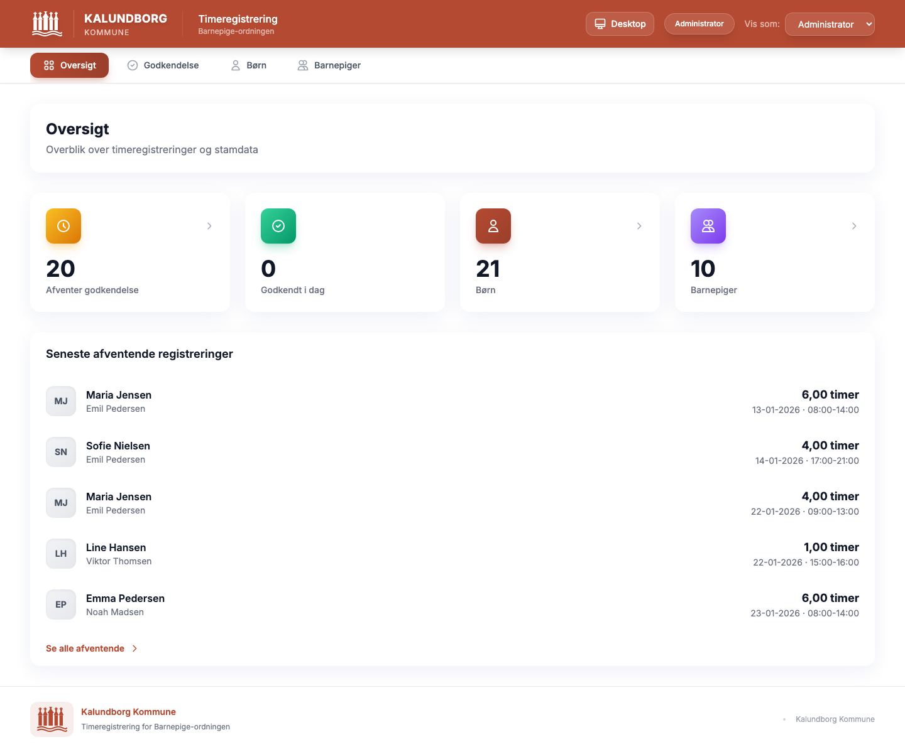
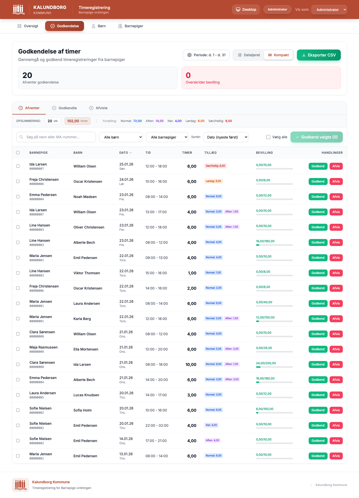
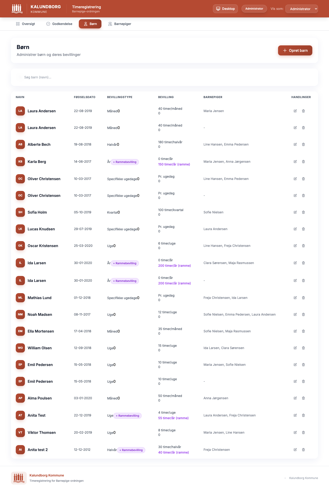
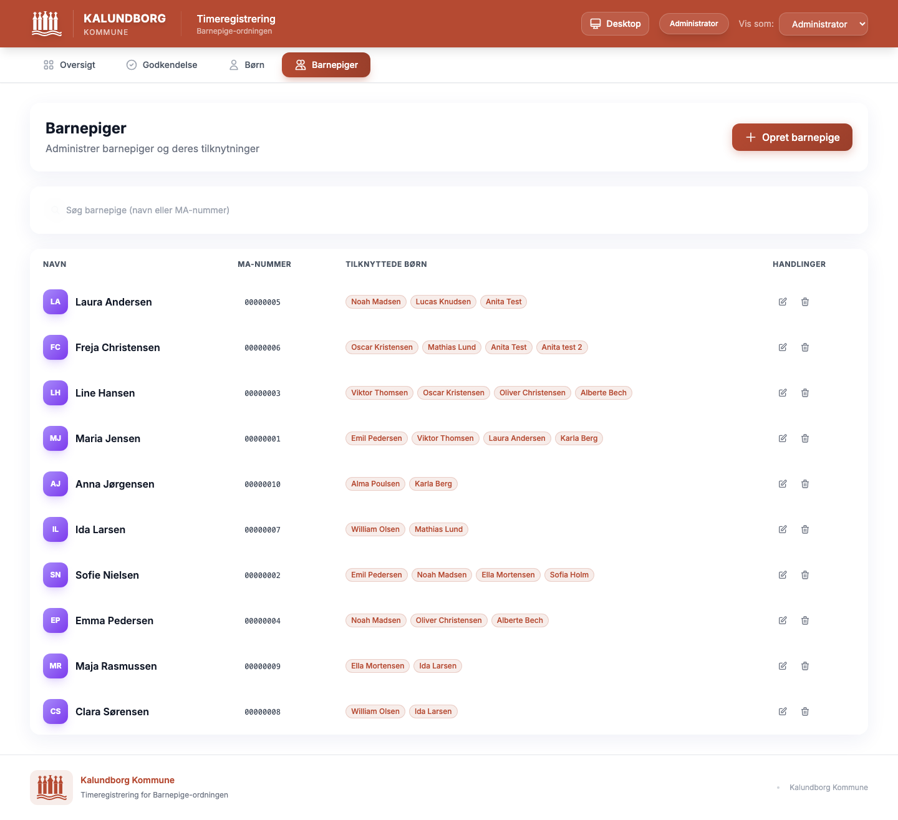
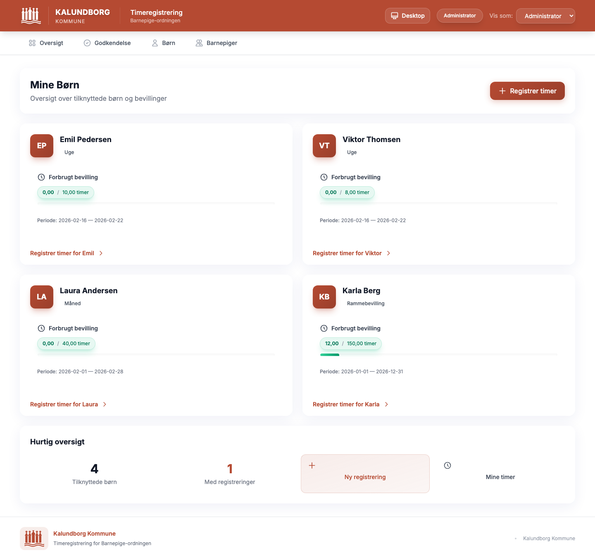
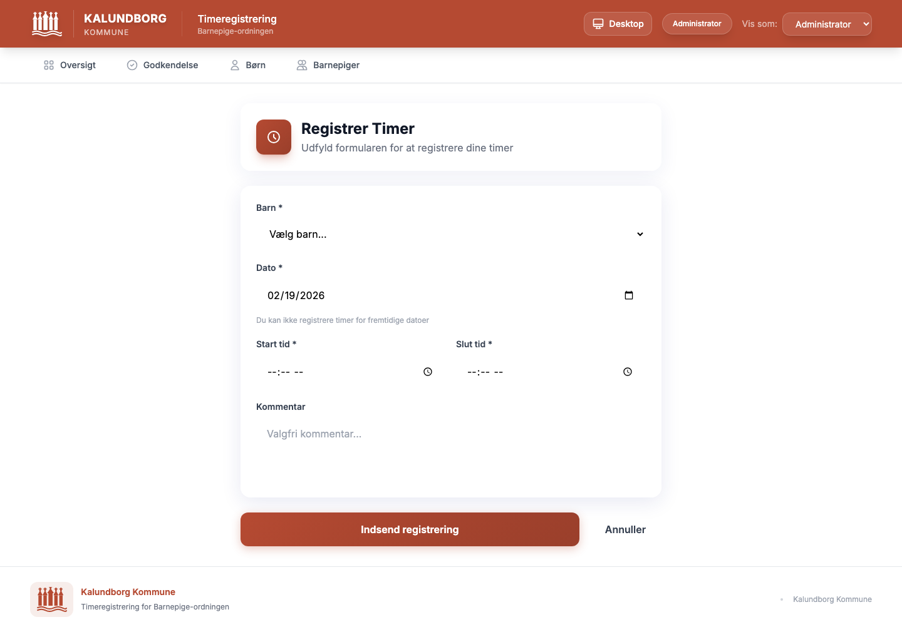
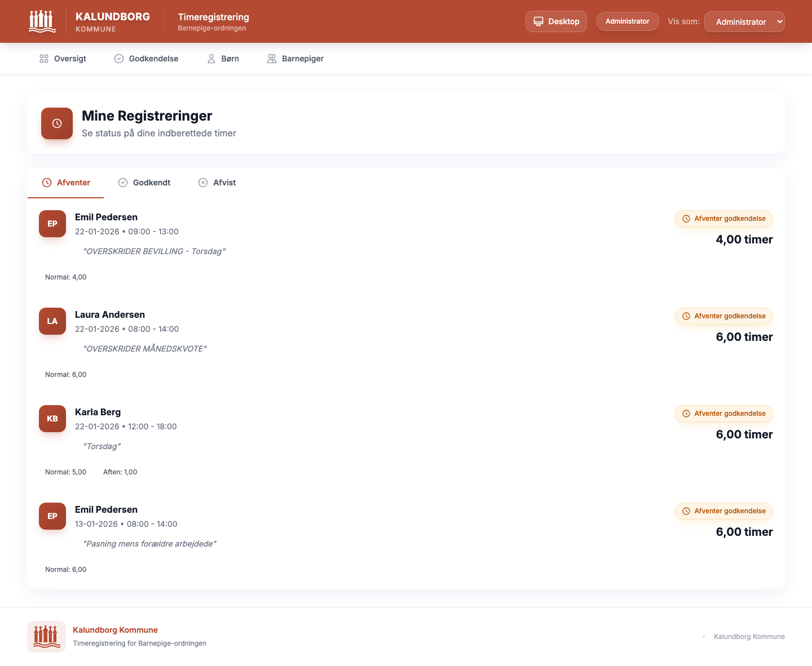
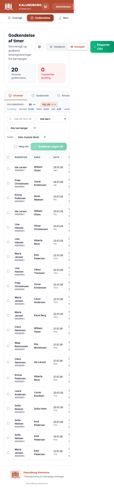

# Barnepige Timeregistrering

Webbaseret system til registrering og godkendelse af timer for barnepiger i Kalundborg Kommune.



## Quick Start

```bash
# Installer dependencies
npm install

# Start både backend og frontend
npm run dev

# Eller start separat:
npm run dev:backend   # Backend på http://localhost:3001
npm run dev:frontend  # Frontend på http://localhost:5173
```

## Demo Data

Kør seed script for at oprette demo data:

```bash
node backend/seed-demo.js      # Basis: 3 barnepiger, 4 børn
node backend/seed-extended.js   # Udvidet: 10 barnepiger, 15 børn, 58 registreringer
node backend/seed-large.js      # Stort datasæt til performance test
```

## Features

### 3-rolle system

Systemet understøtter tre brugerroller med forskellig adgang:

| Rolle | Rettigheder |
|-------|-------------|
| **Administrator** | Fuld adgang: administrer børn, barnepiger, godkend/afvis timer, eksporter CSV |
| **Godkender** | Godkend/afvis timeregistreringer, read-only adgang til børn og barnepiger |
| **Barnepige** | Se tilknyttede børn, registrer timer, se egne registreringer og status |

Rollevalg sker via dropdown i headeren.

### Admin Dashboard

Overblik med opsummeringskort for afventende godkendelser, godkendt i dag, antal børn og barnepiger. Viser seneste afventende registreringer med direkte links.


### Godkendelse af timer

Komplet godkendelsesworkflow med tre tabs: Afventer, Godkendte og Afviste.



**Funktioner:**
- **Detaljeret/Kompakt visning** — skift mellem kortvisning og tabelvisning
- **Opsummeringskort** — total timer, fordeling på tillægstyper (Normal, Aften, Nat, Lørdag, Søn/Hellig)
- **Batch-godkendelse** — vælg flere registreringer og godkend samlet
- **Filtrering** — søg på navn/MA-nummer, filtrer pr. barn og barnepige
- **Sortering** — dato (nyeste/ældste), barnepige, barn, timer
- **Periode-indstilling** — konfigurerbar månedsinterval (f.eks. d. 1-31 eller d. 16-15) med historik
- **CSV eksport** — eksporter alle registreringer til CSV-fil
- **Afvisning med årsag** — popup modal til visning af afvisningsårsag

### Børneadministration

CRUD-operationer for børn med bevillingsopsætning.



**Funktioner:**
- Søgefelt (navn)
- Bevillingstype pr. barn (uge, måned, kvartal, halvår, år, specifikke ugedage)
- Rammebevilling som separat tillæg (årlig bevilling der overruler normal)
- Tilknytning af barnepiger til børn
- Visning af forbrugt vs. bevilget timer

### Barnepige-administration

CRUD-operationer for barnepiger med MA-nummer validering.



**Funktioner:**
- Søgefelt (navn/MA-nummer)
- MA-nummer validering (præcis 8 cifre, zero-padded)
- Oversigt over tilknyttede børn som badges

### Barnepige Dashboard

Barnepigen ser sine tilknyttede børn med bevillingsstatus og hurtige genveje.



**Funktioner:**
- Kort pr. tilknyttet barn med bevillingstype og forbrug
- Progress bar for bevillingsstatus
- Direkte link til timeregistrering pr. barn
- Hurtig oversigt: antal børn, registreringer, genveje

### Registrer timer

Formular til timeregistrering med automatisk tillægsberegning.



**Funktioner:**
- Vælg barn fra dropdown
- Datovælger med blokering af fremtidige datoer (visuel advarsel)
- Start/slut tid med kvarters-afrunding (12:07 → 12:15)
- Live preview af beregnede tillæg før indsendelse
- Valg mellem normal bevilling og rammebevilling
- Advarsel ved bevillingsoverskridelse

### Mine Registreringer

Barnepigen kan følge status på indsendte timer.



**Funktioner:**
- Tabs: Afventer, Godkendt, Afvist
- Tillægsfordeling pr. registrering (Normal, Aften, Nat)
- Advarsler ved bevillingsoverskridelse

### Mobilvisning

Responsivt design med dedikeret mobilvisning.



**Funktioner:**
- Desktop/Mobil toggle i header
- Automatisk kompakt visning på mobile enheder
- Tabeller konverteres til kort-layout
- Tilpassede filtre og navigation

## Tillægsregler

Timer fordeles automatisk i kategorier baseret på tidspunkt og ugedag:

### Hverdage (mandag-fredag)
| Tid | Kategori |
|-----|----------|
| 00:00-06:00 | Nattillæg |
| 06:01-17:00 | Normaltimer |
| 17:01-23:00 | Aftentillæg |
| 23:00-23:59 | Nattillæg |

### Lørdag
| Tid | Kategori |
|-----|----------|
| 00:00-06:00 | Nattillæg |
| 06:01-08:00 | Normaltimer |
| 08:01-23:59 | Lørdagstillæg |

### Søn- og helligdage
| Tid | Kategori |
|-----|----------|
| 00:00-23:59 | Søndags- og helligdagstillæg |

**Helligdage overruler andre dage!** Inkluderer: Nytårsdag, 1. maj, Grundlovsdag, Juleaften, Juledag, 2. juledag, Nytårsaften, samt bevægelige helligdage (Skærtorsdag, Langfredag, Påskedag, 2. påskedag, Kr. Himmelfart, Pinsedag, 2. pinsedag).

Timer rundes op til nærmeste kvarter. Tidsformat er decimalt (0,25 / 0,50 / 0,75 / 1,00).

## Bevillingstyper

| Type | Periode |
|------|---------|
| **Uge** | Mandag til søndag |
| **Måned** | 1. til sidste dag |
| **Kvartal** | Q1-Q4 |
| **Halvår** | H1 (jan-jun) / H2 (jul-dec) |
| **År** | 1. jan til 31. dec |
| **Specifikke ugedage** | Timer pr. valgt ugedag pr. uge |
| **Rammebevilling** | Årlig bevilling (overruler normal) |

Bevillinger er pr. barn, ikke pr. barnepige. Både afventende og godkendte registreringer tæller med i forbruget.

## Tech Stack

- **Frontend**: React 19 + Vite + Tailwind CSS + React Router v7
- **Backend**: Node.js + Express
- **Database**: SQLite (better-sqlite3)
- **Styling**: Kalundborg Kommune branding (#B54A32)

## API Endpoints

| Metode | Endpoint | Beskrivelse |
|--------|----------|-------------|
| `GET` | `/api/children` | Alle børn |
| `GET` | `/api/children/:id` | Barn med barnepiger og bevillingsstatus |
| `POST` | `/api/children` | Opret barn |
| `PUT` | `/api/children/:id` | Opdater barn |
| `DELETE` | `/api/children/:id` | Slet barn |
| `GET` | `/api/caregivers` | Alle barnepiger |
| `POST` | `/api/caregivers` | Opret barnepige |
| `PUT` | `/api/caregivers/:id` | Opdater barnepige |
| `DELETE` | `/api/caregivers/:id` | Slet barnepige |
| `GET` | `/api/time-entries` | Timeregistreringer (filtre: status, child_id, caregiver_id, datointerval) |
| `POST` | `/api/time-entries` | Opret registrering |
| `POST` | `/api/time-entries/preview` | Preview tillægsberegning |
| `PUT` | `/api/time-entries/:id/approve` | Godkend registrering |
| `PUT` | `/api/time-entries/:id/reject` | Afvis registrering |
| `POST` | `/api/time-entries/batch-approve` | Batch-godkend flere |
| `GET` | `/api/export/time-entries` | CSV eksport |
| `GET` | `/api/export/children` | CSV eksport af børn |
| `GET/PUT` | `/api/settings/month-interval` | Månedsinterval indstilling |
| `GET` | `/api/health` | Sundhedstjek |
